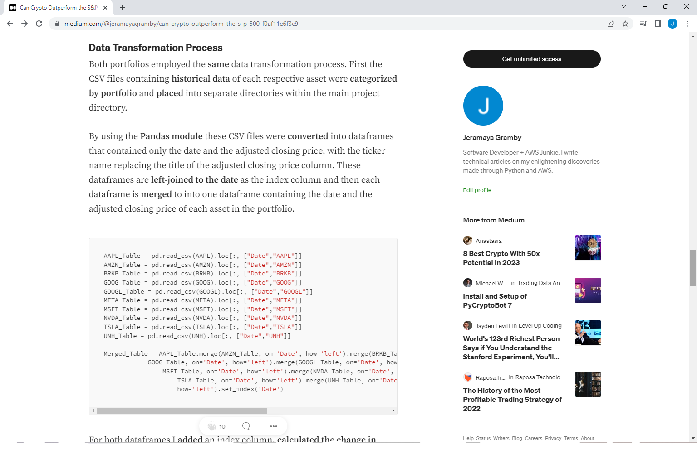

 

## This README file contains:
 
-The purpose of this project.  
-Weaknesses of the project.  
-Instructions for using the program. 
-Link to my Medium article that contains a more detailed explanation.   

                                                Project Purpose:

The purpose of this project is to compare the performance of a stablecoin portfolio consisting of the most liquid 
stablecoin blockchain assets to the performance of the highest weighted companies in the S&P 500 by performing 
Sharpe Ratio analysis which accounts for risk when calculating projected returns.   

This project utilizes the 10 highest weighted companies on the S&P 500 and the 10 most liquid stablecoin assets. The 10 
highest weighted companies have the highest impact on the S&P 500 index's price and therefore are assumed to be the 
most stable companies in the S&P 500 index excluding volatility ratio and dividend return analysis.   

Liquidity, measured in 24 hour trading volume and market capitalization, is preferred for stablecoin assets in this 
project because high liquidity assumes the highest demand and financial support from the community when compared to 
its peers.    

                                                    Weaknesses:

This project has a many shortcomings. First off, the pyportfolioopt module DOES NOT support Python 3.11 as of January 8, 2023 
so 3.7-3.10 must be the configured interpreter. 

In terms of the data collection process, liquid stablecoins with at least 
4 years of historical data are difficult to find so the conclusions drawn from the data made on January 8, 2023 could look 
drastically different over time. 

Several different APIs, including Yahoo Finance's API, did not properly query all the requested stablecoin data. 
For DAI-USD, data recorded on and before November 22, 2019 on Yahoo Finance was missing and Coincodex was missing data for 
DAI-USD recorded on January 30, 2019. Data inconsistency made the data collection process unneccessarily more difficult.

Volatility ratio analysis and dividend returns were not considered in the S&P 500 index portfolio. 
Both volatility and dividend returns influence total returns and could have impacted the assets analyzed for the project. 
   

                                                    Instructions:

1. Ensure all dependencies are installed correctly and Python 3.7, 3.8, 3.9 or 3.10 is the interpreter.

2. If PyPortfolioOpt is not installed use "py -3.10 -m pip install PyPortfolioOpt --use-pep517". Install Cmake + pulp.

3. Run main.py

4. Only run datacleanup.py when inserting different historical data. Running datacleanup.py will always require you to
    convert the ticker symbol entries in SP_500_Agg_Data.csv and Stablecoin_Agg_Data.csv to numbers 0-9 
    and change the name of the missing first index to 'index'.

 

                                            Medium Article Link and Photos:      
https://medium.com/@jeramayagramby/can-crypto-outperform-the-s-p-500-f0af11e6f3c9

